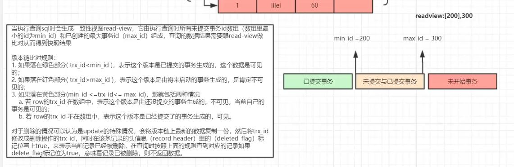

# mysql 并发

## innoDB 的多版本并发控制（MVCC）

MVCC全称Mutli Version Concurreny Control,多版本并发控制，也可称之为一致性非锁定读；它通过行的多版本控制方式来读取当前执行时间数据库中的行数据。实质上使用的是快照数据，这样就可以实现不加锁读。MVCC 主要应用于 Read Commited 和 Repeatable read 两个事务隔离级别。

MVCC的实现依赖于 每行的隐藏字段，`DB_TRX_ID,DB_ROLL_PTR,read_view。`

1. 事务排它锁形式修改数据
2. 修改前先把数据放到UNDOLOG，通过回滚指针关联
3. 成功了什么都不做，失败了从UNDOLOG回滚数据

>三个隐藏字段

innoDB 向数据库中存储的每行添加三个隐藏字段


1. DB_TRX_ID 事务id

占6 字节，表示这一行数据最后插入或修改的事务id。此外删除在内部也被当作一次更新，在行的特殊位置添加一个删除标记（记录头信息有一个字节存储是否删除的标记）。

2. DB_ROLL_PTR 回滚指针

占7字节，回滚指针指向被写在Rollback segment中的undoLog记录，在该行数据被更新的时候，undoLog 会记录该行修改前内容到undoLog。

3. DB_ROW_ID 行ID

占7字节，他就项自增主键一样随着插入新数据自增。如果表中不存主键 或者 唯一索引，那么数据库 就会采用DB_ROW_ID生成聚簇索引。否则DB_ROW_ID不会出现在索引中。

>undo log

undo log是为回滚而用，具体内容就是copy事务前的数据库内容（行）到undo buffer，在适合的时间把undo buffer中的内容刷新到磁盘。undo buffer与redo buffer一样，也是环形缓冲，但当缓冲满的时候，undo buffer中的内容会也会被刷新到磁盘；与redo log不同的是，磁盘上不存在单独的undo log文件，所有的undo log均存放在主ibd数据文件中（表空间），即使客户端设置了每表一个数据文件也是如此。

undo log 在 Rollback segment中又被细分为 insert 和 update undo log , insert 类型的undo log 仅仅用于事务回滚,当事务一旦提交，insert undo log 就会被丢弃。update的undo log 被用于 一致性的读和事务回滚，update undo log 的清理 是在 没有事务 需要对这部分数据快照进行一致性读的时候 进行清理。

undo log 的创建
每次对数据进行更新操作时，都会copy 当前数据,保存到undo log 中。并修改 当前行的 回滚指针指向 undo log 中的 旧数据行。

>read_view一致性视图 判断数据行可见性

在innodb中，创建一个新事务的时候，innodb会将当前系统中的活跃事务列表创建一个副本（read view），副本中保存的是系统当前不应该被本事务看到的其他事务id列表。当用户在这个事务中要读取该行记录的时候，innodb会将该行当前的版本号与该read view进行比较。

版本链比对规则（可重复读级别）：



假设当前 数据行 事务ID 为 T0 ，read view 中保存的 最老的事务id T_min ,最新的 事务id 为 T_max,当前进行的事务id 为 T_new 。

- 如果 T0 < T_min ,那么该行数据可见。

因为 T0 在 T_new 事务开始前 已经提交。

- 如果 T0 > T_max ,数据行不可见。根据DB_ROLL_PTR 指针 找到下一个 数据版本，再次进行数据可见性判断。

因为 T0事务 在 T_new 开始前并不存在，也就是说T0 在T_new 开始后 创建。

- 如果 T_min <= T0 <= T_max ，判断T0 是否在read_view 中，如果 不在该行数据可见。如果不可见根据DB_ROLL_PTR 指针 找到下一个 数据版本，再次进行数据可见性判断。

>Read Commited ，Repeatable read 数据可见性判断

Read Commited 和 Repeatable read 采用相同的数据可见性判断逻辑。
那么怎么在相同的判断逻辑下 分别 实现 RC 和 RR 级别的？

- Read Commited
    - 在每次语句执行的过程中，都关闭read_view, 重新创建当前的一份新的read_view。
    这样就可以根据当前的全局事务链表创建read_view的事务区间，实现read committed隔离级别。
- Repeatable read
    - 在repeatable read的隔离级别下，创建事务trx结构的时候，就生成了当前的global read view。
    使用trx_assign_read_view函数创建，一直维持到事务结束，这样就实现了repeatable read隔离级别。

正是因为Read Commited和 Repeatable read的read view 生成方式和时机不同，导致在不同隔离级别下,read committed 总是读最新一份快照数据，而repeatable read 读事务开始时的行数据版本。所有。商业转载请联系作者获得授权，非商业转载请注明出处。

## InnoDB 锁类型

>S or X (共享锁&排他锁)

在 InnoDB 中实现了两个标准的行级锁，可以简单的看为两个读写锁：

S 共享锁：又叫读锁，其他事务可以继续加共享锁，但是不能继续加排他锁。

X 排他锁：又叫写锁，一旦加了写锁之后，其他事务就不能加锁了。

>IS or IX (共享&排他)意向锁

意向锁在 InnoDB 中是表级锁，意向锁分为：

意向共享锁：表达一个事务想要获取一张表中某几行的共享锁。

意向排他锁：表达一个事务想要获取一张表中某几行的排他锁。

这个锁有什么用呢？为什么需要这个锁呢？

首先说一下如果没有这个锁，要给这个表加上表锁，一般的做法是去遍历每一行看看它是否有行锁，这样的话效率太低。而我们有意向锁，只需要判断是否有意向锁即可，不需要再去一行行的去扫描。

>自增长锁

自增长锁是一种特殊的表锁机制，提升并发插入性能。对于这个锁有几个特点：

- 在 SQL 执行完就释放锁，并不是事务执行完。

- 对于 insert...select 大数据量插入会影响插入性能，因为会阻塞另外一个事务执行。

- 自增算法可以配置。

在 MySQL 中 innodb_auto_inclock_mode 有 3 种配置模式 0、1、2，分别对应：

- 传统模式：使用表锁。

- 连续模式：对于插入的时候可以确定行数的使用互斥量，对于不能确定行数的使用表锁的模式。

- 交错模式：所有的都使用互斥量，为什么叫交错模式呢，有可能在批量插入时自增值不是连续的，当然一般来说如果不看重自增值连续一般选择这个模式，性能是最好的。


相关命令：
```sql
show engines;  #查看数据库支持的引擎
show variables like '%storage_engine%';   #查看数据库默认的引擎
select @@global.tx_isolation; #查询数据库的隔离级别
show variables like 'innodb_autoinc_lock_mode';  #获取到当前自增长锁的模式
select * from information_schema.INNODB_LOCKS;  #获取到当前加锁情况
show InnoDB status;  #查看最近死锁的日志。

```

## InnoDB 锁算法 


>记录锁(Record-Lock)

记录锁是锁住记录的，锁住的是索引记录，而不是我们真正的数据记录：

如果锁的是非主键索引，会在自己的索引上面加锁之后然后再去主键上面加锁锁住。

如果表上没有索引(包括没有主键)，则会使用隐藏的主键索引进行加锁。

如果要锁的没有索引，则会进行全表记录加锁。 

>间隙锁

间隙锁顾名思义锁间隙，不锁记录。锁间隙的意思就是锁定某一个范围，间隙锁又叫 gap 锁，其不会阻塞其他的 gap 锁，但是会阻塞插入间隙锁，这也是用来防止幻读的关键。

>next-key 锁 

这个锁本质是记录锁加上 gap 锁。在 RR 隔离级别下(InnoDB 默认)，InnoDB 对于行的扫描锁定都是使用此算法，但是如果查询扫描中有唯一索引会退化成只使用记录锁。

因为唯一索引能确定行数，而其他索引不能确定行数，需要使用间隙锁防止其他事务中再次添加这个索引的数据造成幻读。RR 隔离级别下，InnoDB 使用 Next-Key Lock 算法避免了幻读。