## hadoop集群搭建
### 单机hadoop搭建
#### 安装java
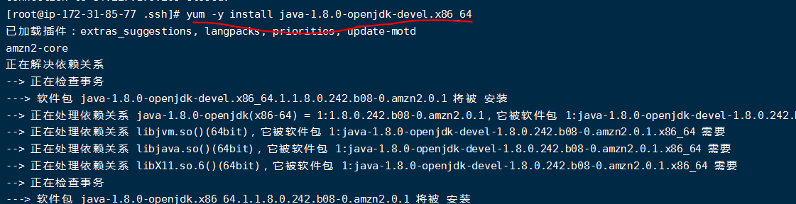
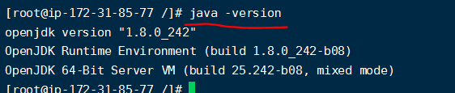

#### 禁用ipv6
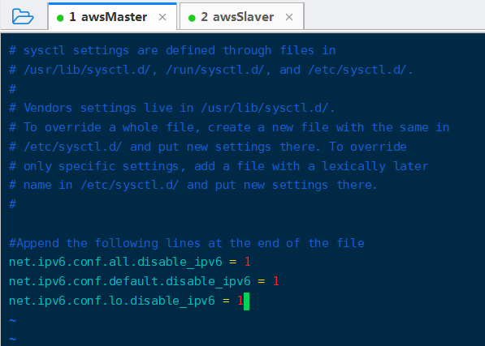

#### 解压hadoop包

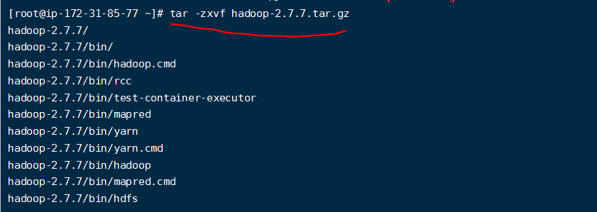

#### 构建DataNode，NameNode
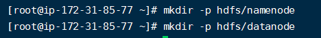

#### 更新环境变量

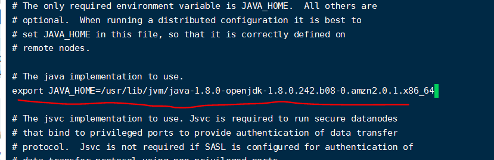

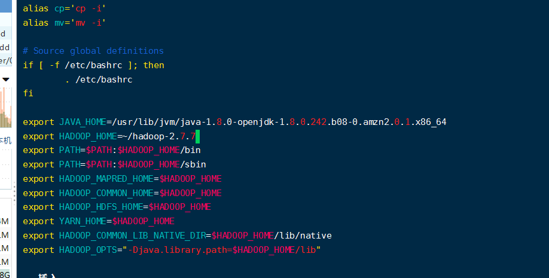
#### 更新配置文件
#### etc/hadoop/core-site.xml：
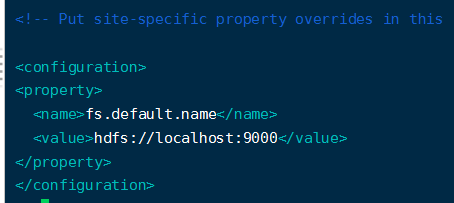
#### etc/hadoop/hdfs-site.xml：
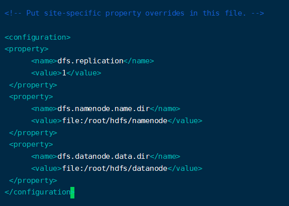
#### etc/hadoop/yarn-site.xml
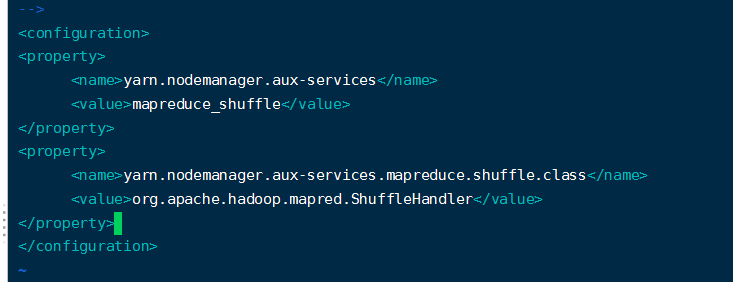
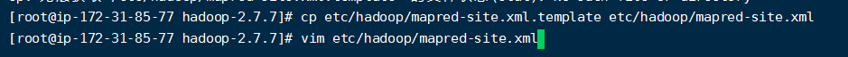
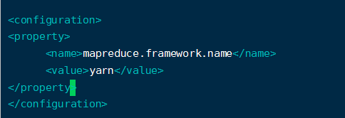
#### 格式化namenode，启动hadoop
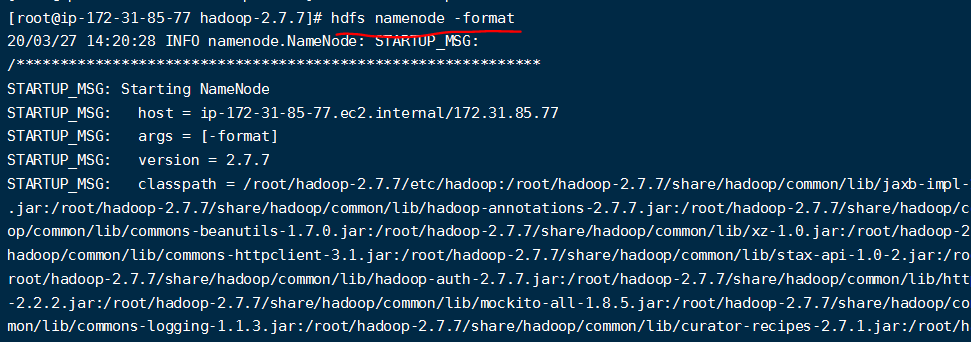
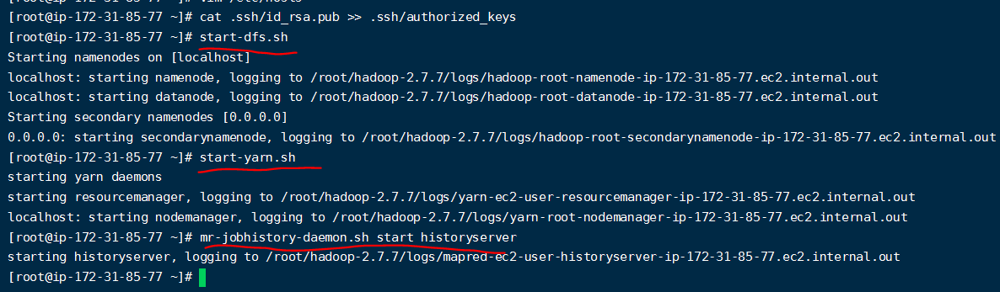
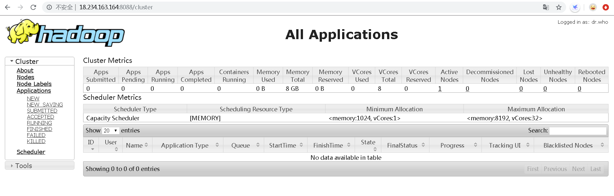

### 集群搭建
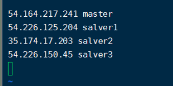
#### 免密登录ssh
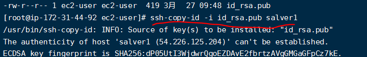

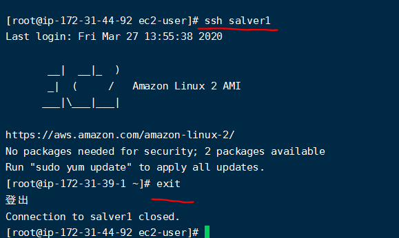
#### salver2,3
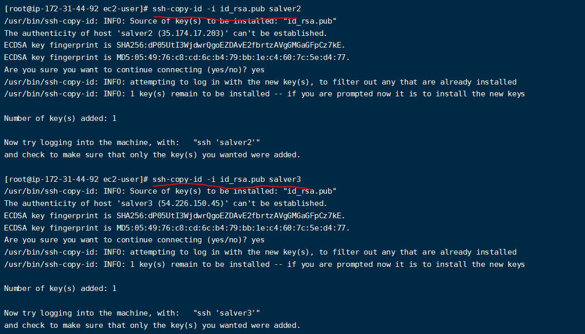
#### 更新配置文件
#### core-site.xml
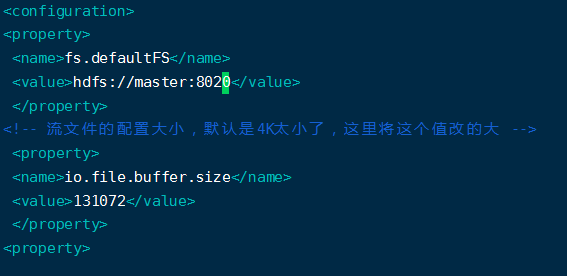
#### yarn-site.xml
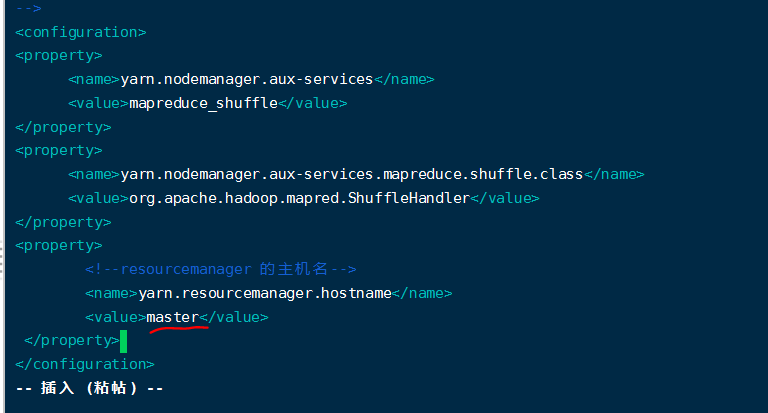
#### /etc/hadoop/slaves:
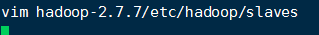

#### 初始化hdfs namenode -format
- 如果直接格式clusterID将不一致,需要删除datanode,namenode,logs目录
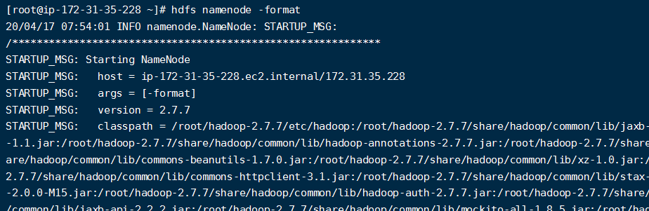

#### 启动集群
#### start-dfs.sh
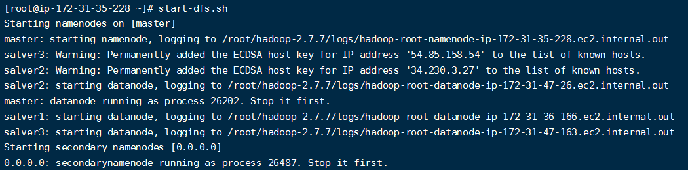
#### start-yarn.sh
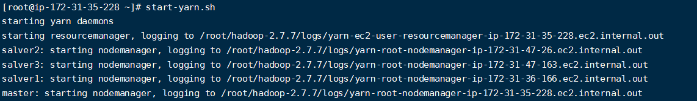
#### Start Job History Server

####  Jps 查看进程:
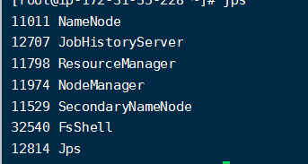
#### slavers：
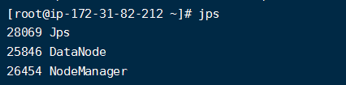

