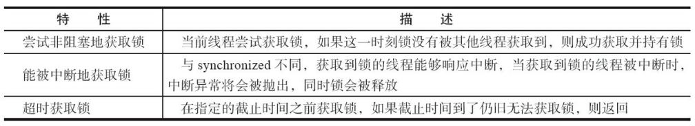
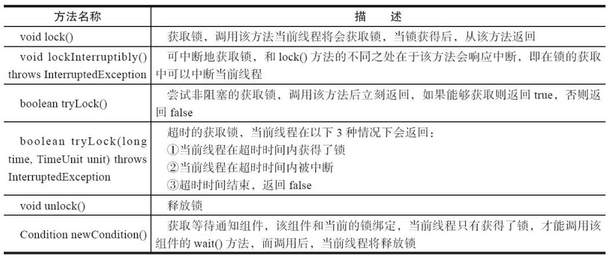
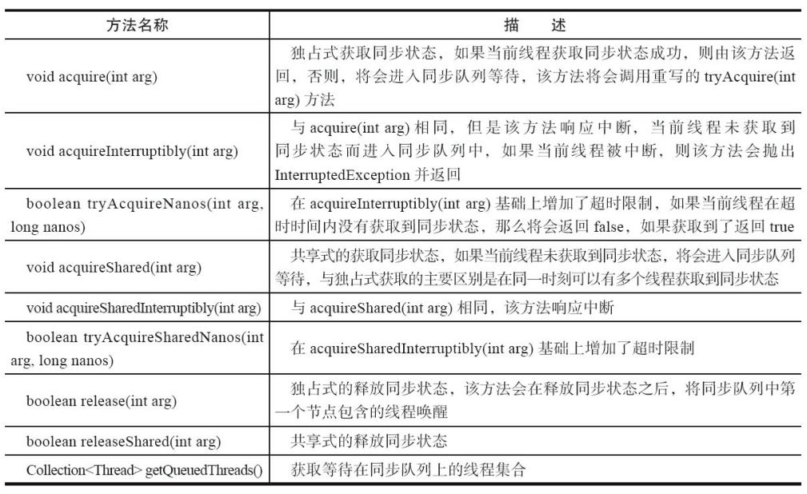
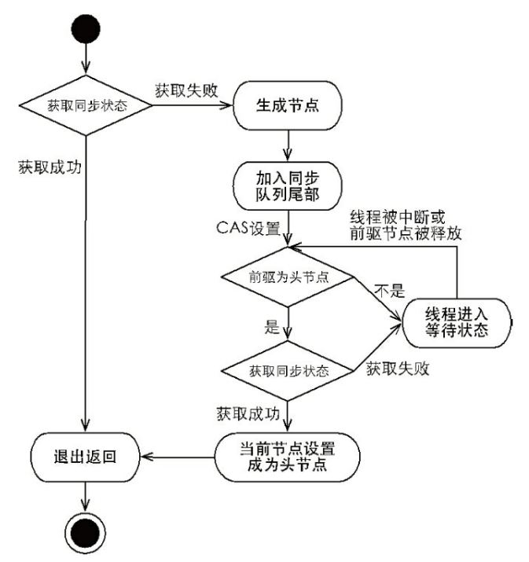
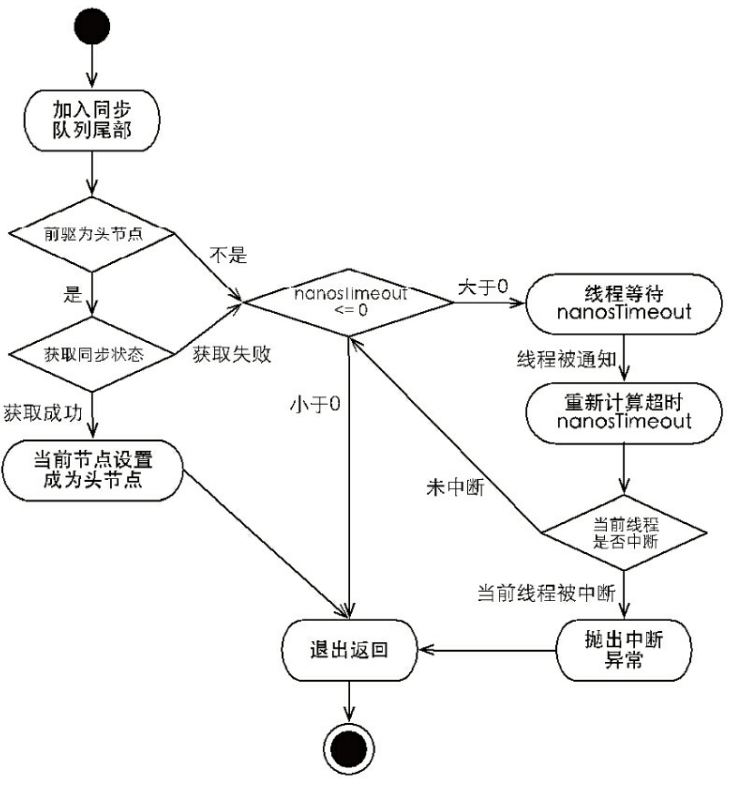
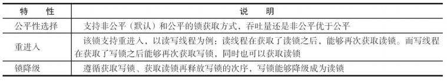
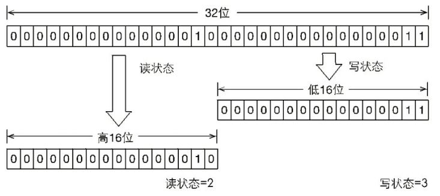
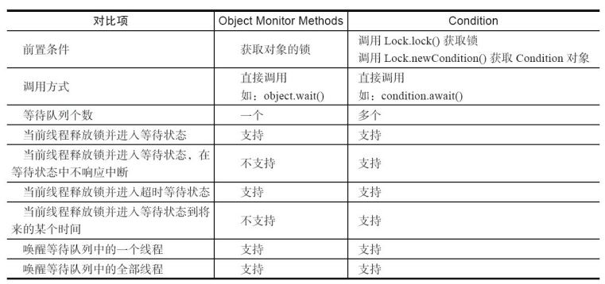
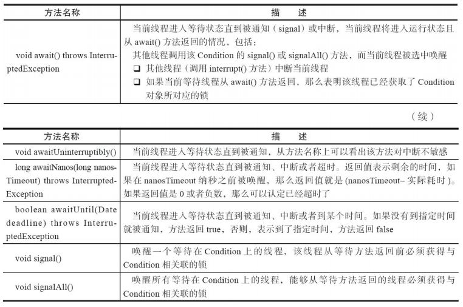

## Java中的锁

### Lock接口

* 锁是用来控制多个线程访问共享资源的方式，一般来说，一个锁能够防止多个线程同时访问共享资源（但是有些锁可以允许多个线程并发的访问共享资源，比如读写锁）。

* 在Lock接口出现之前，Java程序是靠synchronized关键字实现锁功能的，而Java SE 5之后，并发包中新增 了Lock接口（以及相关实现类）用来实现锁功能，它提供了与synchronized关键字类似的同步功 能，只是在使用时需要显式地获取和释放锁。

* 虽然它缺少了（通过synchronized块或者方法所提 供的）隐式获取释放锁的便捷性，但是却拥有了锁获取与释放的可操作性、可中断的获取锁以 及超时获取锁等多种synchronized关键字所不具备的同步特性。


#### Lock的使用的方式

```java
Lock lock = new ReentrantLock(); 
lock.lock(); 
try { 

} finally { 
    lock.unlock(); 
}
```

`Lock接口提供的synchronized关键字不具备的主要特性`



#### Lock的API



* AbstractQueuedSynchronizer以及常用Lock接口的实现ReentrantLock。Lock接口的实现基本都是 通过聚合了一个同步器的子类来完成线程访问控制的。

### 队列同步器AQS

* 队列同步器AbstractQueuedSynchronizer（以下简称同步器），是用来构建锁或者其他同步组件的基础框架，`它使用了一个int成员变量表示同步状态，通过内置的FIFO队列来完成资源获 取线程的排队工作`，并发包的作者（Doug Lea）期望它能够成为实现大部分同步需求的基础。

* 同步器的主要使用方式是继承，子类通过继承同步器并实现它的抽象方法来管理同步状 态，在抽象方法的实现过程中免不了要对同步状态进行更改，这时就需要使用同步器提供的3 个方法（getState()、setState(int newState)和compareAndSetState(int expect,int update)）来进行操 作，因为它们能够保证状态的改变是安全的。子类推荐被定义为自定义同步组件的静态内部类，同步器自身没有实现任何同步接口，它仅仅是定义了若干同步状态获取和释放的方法来 供自定义同步组件使用，同步器既可以支持独占式地获取同步状态，也可以支持共享式地获取同步状态，这样就可以方便实现不同类型的同步组件（ReentrantLock、 ReentrantReadWriteLock和CountDownLatch等）。

* 同步器是实现锁（也可以是任意同步组件）的关键，在锁的实现中聚合同步器，利用同步 器实现锁的语义。可以这样理解二者之间的关系：锁是面向使用者的，它定义了使用者与锁交 互的接口（比如可以允许两个线程并行访问），隐藏了实现细节；同步器面向的是锁的实现者， 它简化了锁的实现方式，屏蔽了同步状态管理、线程的排队、等待与唤醒等底层操作。锁和同 步器很好地隔离了使用者和实现者所需关注的领域。

#### 同步器提供的模板方法




同步器提供的模板方法基本上分为3类：`独占式`获取与释放同步状态、`共享式`获取与释放 同步状态和查询同步队列中的等待线程情况。

* 独占锁就是在同一时刻只能有一个线程获取到锁，而其他获取锁的线程只能 处于同步队列中等待，只有获取锁的线程释放了锁，后继的线程才能够获取锁

#### 队列同步器分析

`同步队列`

* 同步器依赖内部的同步队列（一个FIFO双向队列）来完成同步状态的管理，当前线程获取 同步状态失败时，同步器会将当前线程以及等待状态等信息构造成为一个节点（Node）并将其 加入同步队列，同时会阻塞当前线程，当同步状态释放时，会把首节点中的线程唤醒，使其再 次尝试获取同步状态。
* 同步队列中的节点（Node）用来保存获取同步状态失败的线程引用、等待状态以及前驱和 后继节点

`独占式同步状态获取流程`



`独占式超时获取同步状态的流程`




`共享式同步状态获取与释放`

* 共享式获取与独占式获取最主要的区别在于同一时刻能否有多个线程同时获取到同步状态。以文件的读写为例，如果一个程序在对文件进行读操作，那么这一时刻对于该文件的写操作均被阻塞，而读操作能够同时进行。写操作要求对资源的独占式访问，而读操作可以是共享式访问，两种不同的访问模式在同一时刻对文件或资源的访问情况。

#### 重入锁

* 重入锁ReentrantLock，顾名思义，就是支持重进入的锁，它表示该锁能够支持一个线程对 资源的重复加锁。除此之外，该锁的还支持获取锁时的公平和非公平性选择。

* synchronized关键字隐式的支持重进入，比如一个synchronized修饰的递归方法，在方法执行时，执行线程在获取了锁之后仍能连续多次地获得该锁，ReentrantLock虽然没能像synchronized关键字一样支持隐式的重进入，但是在调用lock()方法时，已经获取到锁的线程，能够再次调用lock()方法获取锁而不被阻塞。

* 如果在绝对时间上，先对锁进行获取的请求一定先被满足，那么这个锁是公平的，反之，是不公平的。公平的获取锁，也就是等待时间最长的线 程最优先获取锁，也可以说锁获取是顺序的。ReentrantLock提供了一个构造函数，能够控制锁是否是公平的。

* 公平的锁机制往往没有非公平的效率高，但是，并不是任何场景都是以TPS作为唯一的指标，公平锁能够减少“饥饿”发生的概率，等待越久的请求越是能够得到优先满足。

#### 实现重进入

重进入是指任意线程在获取到锁之后能够再次获取该锁而不会被锁所阻塞，该特性的实 现需要解决以下两个问题。

* 1）`线程再次获取锁`。锁需要去识别获取锁的线程是否为当前占据锁的线程，如果是，则再次成功获取。

* 2）`锁的最终释放`。线程重复n次获取了锁，随后在第n次释放该锁后，其他线程能够获取到该锁。锁的最终释放要求锁对于获取进行计数自增，计数表示当前锁被重复获取的次数，而锁被释放时，计数自减，当计数等于0时表示锁已经成功释放。

* ReentrantLock是通过组合自定义同步器来实现锁的获取与释放

#### 公平与非公平获取锁的区别

* 公平性与否是针对获取锁而言的，如果一个锁是公平的，那么锁的获取顺序就应该符合 请求的绝对时间顺序，也就是FIFO。

* 公平性锁每次都是从同步队列中的 第一个节点获取到锁，而非公平性锁可能一个线程连续获取锁的情况。

### 读写锁

* 之前提到锁（如Mutex和ReentrantLock）基本都是排他锁，这些锁在同一时刻只允许一个线 程进行访问，而读写锁在同一时刻可以允许多个读线程访问，但是在写线程访问时，所有的读 线程和其他写线程均被阻塞。读写锁维护了一对锁，一个读锁和一个写锁，通过分离读锁和写锁，使得并发性相比一般的排他锁有了很大提升。

* 除了保证写操作对读操作的可见性以及并发性的提升之外，读写锁能够简化读写交互场 景的编程方式。假设在程序中定义一个共享的用作缓存数据结构，它大部分时间提供读服务（例如查询和搜索），而写操作占有的时间很少，但是写操作完成之后的更新需要对后续的读服务可见

* 在没有读写锁支持的（Java 5之前）时候，如果需要完成上述工作就要使用Java的等待通知机制，就是当写操作开始时，所有晚于写操作的读操作均会进入等待状态，只有写操作完成并 进行通知之后，所有等待的读操作才能继续执行（写操作之间依靠synchronized关键进行同步），这样做的目的是使读操作能读取到正确的数据，不会出现脏读。改用读写锁实现上述功能，只需要在读操作时获取读锁，写操作时获取写锁即可。当写锁被获取到时，后续（非当前写 操作线程）的读写操作都会被阻塞，写锁释放之后，所有操作继续执行，编程方式相对于使用等待通知机制的实现方式而言，变得简单明了。

* 一般情况下，读写锁的性能都会比排它锁好，因为大多数场景读是多于写的。在读多于写 的情况下，读写锁能够提供比排它锁更好的并发性和吞吐量。Java并发包提供读写锁的实现是 ReentrantReadWriteLock


`ReentrantReadWriteLock的特性`



#### 读写状态的设计

* 读写锁同样依赖自定义同步器来实现同步功能，而读写状态就是其同步器的同步状态。 回想ReentrantLock中自定义同步器的实现，同步状态表示锁被一个线程重复获取的次数，而读写锁的自定义同步器需要在同步状态（一个整型变量）上维护多个读线程和一个写线程的状态，使得该状态的设计成为读写锁实现的关键

* 如果在一个整型变量上维护多种状态，就一定需要“按位切割使用”这个变量，读写锁将变量切分成了两个部分，高16位表示读，低16位表示写




#### 写锁的获取与释放

* 写锁是一个支持重进入的排它锁。如果当前线程已经获取了写锁，则增加写状态。如果当前线程在获取写锁时，读锁已经被获取（读状态不为0）或者该线程不是已经获取写锁的线程， 则当前线程进入等待状态

* 如果存在读锁，则写锁不能被获取，原因在于：读写锁要确保写锁的操作对读锁可见，如 果允许读锁在已被获取的情况下对写锁的获取，那么正在运行的其他读线程就无法感知到当 前写线程的操作。因此，只有等待其他读线程都释放了读锁，写锁才能被当前线程获取，而写锁一旦被获取，则其他读写线程的后续访问均被阻塞。

* 写锁的释放与ReentrantLock的释放过程基本类似，每次释放均减少写状态，当写状态为0 时表示写锁已被释放，从而等待的读写线程能够继续访问读写锁，同时前次写线程的修改对后续读写线程可见。

#### 读锁的获取与释放

* 读锁是一个支持重进入的共享锁，它能够被多个线程同时获取，在没有其他写线程访问 （或者写状态为0）时，读锁总会被成功地获取，而所做的也只是（线程安全的）增加读状态。如 果当前线程已经获取了读锁，则增加读状态。如果当前线程在获取读锁时，写锁已被其他线程 获取，则进入等待状态。获取读锁的实现从Java 5到Java 6变得复杂许多，主要原因是新增了一 些功能，例如getReadHoldCount()方法，作用是返回当前线程获取读锁的次数。读状态是所有线 程获取读锁次数的总和，而每个线程各自获取读锁的次数只能选择保存在ThreadLocal中，由 线程自身维护，这使获取读锁的实现变得复杂。

* 读锁的每次释放（线程安全的，可能有多个读线程同时释放读锁）均减少读状态，减少的值是（1<<16）。

#### 锁降级

* 锁降级指的是写锁降级成为读锁。如果当前线程拥有写锁，然后将其释放，最后再获取读锁，这种分段完成的过程不能称之为锁降级。锁降级是指把持住（当前拥有的）写锁，再获取到读锁，随后释放（先前拥有的）写锁的过程。

* `锁降级中读锁的获取是否必要呢？`答案是必要的。主要是为了保证数据的可见性，如果 当前线程不获取读锁而是直接释放写锁，假设此刻另一个线程（记作线程T）获取了写锁并修 改了数据，那么当前线程无法感知线程T的数据更新。如果当前线程获取读锁，即遵循锁降级 的步骤，则线程T将会被阻塞，直到当前线程使用数据并释放读锁之后，线程T才能获取写锁进 行数据更新。

* ReentrantReadWriteLock不支持锁升级（把持读锁、获取写锁，最后释放读锁的过程）。目的 也是保证数据可见性，如果读锁已被多个线程获取，其中任意线程成功获取了写锁并更新了 数据，则其更新对其他获取到读锁的线程是不可见的。

### Condition接口

* 任意一个Java对象，都拥有一组监视器方法（定义在java.lang.Object上），主要包括wait()、 wait(long timeout)、notify()以及notifyAll()方法，这些方法与synchronized同步关键字配合，可以 实现等待/通知模式。Condition接口也提供了类似Object的监视器方法，与Lock配合可以实现等待/通知模式，但是这两者在使用方式以及功能特性上还是有差别的。

`Object的监视器方法与Condition接口的对比`



* Condition定义了等待/通知两种类型的方法，当前线程调用这些方法时，需要提前获取到 Condition对象关联的锁。Condition对象是由Lock对象（调用Lock对象的newCondition()方法）创 建出来的，换句话说，Condition是依赖Lock对象的。



#### Condition的实现分析

* ConditionObject是同步器AbstractQueuedSynchronizer的内部类，因为Condition的操作需要获取相关联的锁，所以作为同步器的内部类也较为合理。每个Condition对象都包含着一个队列（以下称为等待队列），该队列是Condition对象实现等待/通知功能的关键。