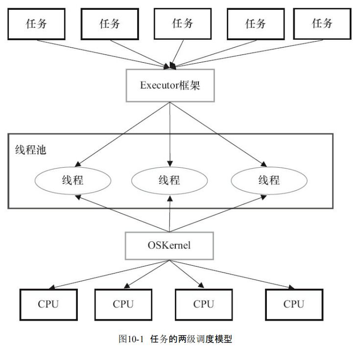
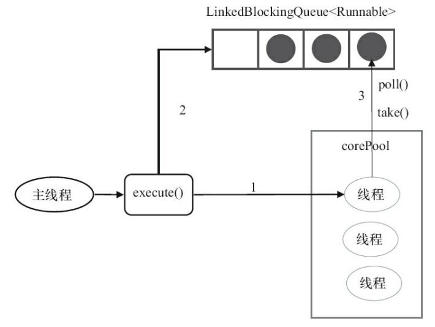

## Executor框架
* 在Java中，使用线程来异步执行任务。Java线程的创建与销毁需要一定的开销，如果我们 为每一个任务创建一个新线程来执行，这些线程的创建与销毁将消耗大量的计算资源。同时， 为每一个任务创建一个新线程来执行，这种策略可能会使处于高负荷状态的应用最终崩溃。

* Java的线程既是工作单元，也是执行机制。从JDK 5开始，把工作单元与执行机制分离开来。工作单元包括Runnable和Callable，而执行机制由Executor框架提供。

### Executor框架的两级调度模型

* 在HotSpot VM的线程模型中，Java线程（java.lang.Thread）被一对一映射为本地操作系统线 程。Java线程启动时会创建一个本地操作系统线程；当该Java线程终止时，这个操作系统线程也会被回收。操作系统会调度所有线程并将它们分配给可用的CPU。

* 在上层，Java多线程程序通常把应用分解为若干个任务，然后使用用户级的调度器 （Executor框架）将这些任务映射为固定数量的线程；在底层，操作系统内核将这些线程映射到 硬件处理器上。



### Executor框架的结构

- Executor框架主要由3大部分组成如下。
    - 任务。包括被执行任务需要实现的接口：Runnable接口或Callable接口。
    - 任务的执行。包括任务执行机制的核心接口Executor，以及继承自Executor的 ExecutorService接口。Executor框架有两个关键类实现了ExecutorService接口 （ThreadPoolExecutor和ScheduledThreadPoolExecutor）。
    - 异步计算的结果。包括接口Future和实现Future接口的FutureTask类。

- Executor框架包含的主要的类与接口:
    - Executor是一个接口，它是Executor框架的基础，它将任务的提交与任务的执行分离开 来。
    - ThreadPoolExecutor是线程池的核心实现类，用来执行被提交的任务。
    - ScheduledThreadPoolExecutor是一个实现类，可以在给定的延迟后运行命令，或者定期执行命令。ScheduledThreadPoolExecutor比Timer更灵活，功能更强大。 
    - Future接口和实现Future接口的FutureTask类，代表异步计算的结果。
    - Runnable接口和Callable接口的实现类，都可以被ThreadPoolExecutor或Scheduled- ThreadPoolExecutor执行。

### Executor框架的成员

Executor框架的主要成员：ThreadPoolExecutor、ScheduledThreadPoolExecutor、 Future接口、Runnable接口、Callable接口和Executors。

#### ThreadPoolExecutor

ThreadPoolExecutor通常使用工厂类Executors来创建。Executors可以创建3种类型的 ThreadPoolExecutor：SingleThreadExecutor、FixedThreadPool和CachedThreadPool。

* `FixedThreadPool`。下面是Executors提供的，创建使用固定线程数的FixedThreadPool的API。

```java
public static ExecutorService newFixedThreadPool(int nThreads) 
public static ExecutorService newFixedThreadPool(int nThreads, ThreadFactorythreadFactoty threadFactorythreadFactoty)
```

* FixedThreadPool适用于为了满足资源管理的需求，而需要限制当前线程数量的应用场景，它适用于负载比较重的服务器。

* `SingleThreadExecutor`。下面是Executors提供的，创建使用单个线程的SingleThread- Executor的API。

```java
public static ExecutorService newSingleThreadExecutor() 
public static ExecutorService newSingleThreadExecutor(ThreadFactory threadFactory)
```
* SingleThreadExecutor适用于需要保证顺序地执行各个任务；并且在任意时间点，不会有多个线程是活动的应用场景。

* `CachedThreadPool`。下面是Executors提供的，创建一个会根据需要创建新线程的 CachedThreadPool的API。
```java
public static ExecutorService newCachedThreadPool() 
public static ExecutorService newCachedThreadPool(ThreadFactory threadFactory)
```

* CachedThreadPool是大小无界的线程池，适用于执行很多的短期异步任务的小程序，或者是负载较轻的服务器。

#### ScheduledThreadPoolExecutor

- ScheduledThreadPoolExecutor通常使用工厂类Executors来创建。Executors可以创建2种类 型的ScheduledThreadPoolExecutor，如下。 
    - ScheduledThreadPoolExecutor。包含若干个线程的ScheduledThreadPoolExecutor。 
    - SingleThreadScheduledExecutor。只包含一个线程的ScheduledThreadPoolExecutor。

* ScheduledThreadPoolExecutor适用于需要多个后台线程执行周期任务，同时为了满足资源 管理的需求而需要限制后台线程的数量的应用场景。下面是Executors提供的，创建单个线程 的SingleThreadScheduledExecutor的API。

* SingleThreadScheduledExecutor适用于需要单个后台线程执行周期任务，同时需要保证顺 序地执行各个任务的应用场景。

#### Future接口

Future接口和实现Future接口的FutureTask类用来表示异步计算的结果。当我们把Runnable 接口或Callable接口的实现类提交（submit）给ThreadPoolExecutor或 ScheduledThreadPoolExecutor时，ThreadPoolExecutor或ScheduledThreadPoolExecutor会向我们 返回一个FutureTask对象。

* `注意`，到目前最新的JDK 8为止，Java通过上述API返回的是一个 FutureTask对象。但从API可以看到，Java仅仅保证返回的是一个实现了Future接口的对象。在将来的JDK实现中，返回的可能不一定是FutureTask。

#### Runnable接口和Callable接口

* Runnable接口和Callable接口的实现类，都可以被ThreadPoolExecutor或Scheduled- ThreadPoolExecutor执行。它们之间的区别是Runnable不会返回结果，而Callable可以返回结果。

* 除了可以自己创建实现Callable接口的对象外，还可以使用工厂类Executors来把一个Runnable包装成一个Callable。

* 当我们把一个Callable对象提交给 ThreadPoolExecutor或ScheduledThreadPoolExecutor执行时，submit（…）会向我们返回一个 FutureTask对象。我们可以执行FutureTask.get()方法来等待任务执行完成。当任务成功完成后 FutureTask.get()将返回该任务的结果。

### ThreadPoolExecutor详解

- Executor框架最核心的类是ThreadPoolExecutor，它是线程池的实现类，主要由下列4个组 件构成。
    - corePool：核心线程池的大小。
    - maximumPool：最大线程池的大小。
    - BlockingQueue：用来暂时保存任务的工作队列。 
    - RejectedExecutionHandler：当ThreadPoolExecutor已经关闭或ThreadPoolExecutor已经饱和 时（达到了最大线程池大小且工作队列已满），execute()方法将要调用的Handler。

- 通过Executor框架的工具类Executors，可以创建3种类型的ThreadPoolExecutor。 
    - FixedThreadPool。
    - SingleThreadExecutor。
    - CachedThreadPool。

* FixedThreadPool被称为可重用固定线程数的线程池。下面是FixedThreadPool的源代码实现。
```java
public static ExecutorService newFixedThreadPool(int nThreads) { 
    return new ThreadPoolExecutor(nThreads, nThreads, 0L, TimeUnit.MILLISECONDS, new LinkedBlockingQueue<Runnable>()); 
}
```
#### FixedThreadPool
* FixedThreadPool的corePoolSize和maximumPoolSize都被设置为创建FixedThreadPool时指 定的参数nThreads。 
* 当线程池中的线程数大于corePoolSize时，keepAliveTime为多余的空闲线程等待新任务的 最长时间，超过这个时间后多余的线程将被终止。这里把keepAliveTime设置为0L，意味着多余 的空闲线程会被立即终止。



- 流程
  - 1）如果当前运行的线程数少于corePoolSize，则创建新线程来执行任务。
  - 2）在线程池完成预热之后（当前运行的线程数等于corePoolSize），将任务加入 LinkedBlockingQueue。
  - 3）线程执行完1中的任务后，会在循环中反复从LinkedBlockingQueue获取任务来执行。

- FixedThreadPool使用无界队列LinkedBlockingQueue作为线程池的工作队列（队列的容量为 Integer.MAX_VALUE）。使用无界队列作为工作队列会对线程池带来如下影响。
    - 1）当线程池中的线程数达到corePoolSize后，新任务将在无界队列中等待，因此线程池中 的线程数不会超过corePoolSize。
    - 2）由于1，使用无界队列时maximumPoolSize将是一个无效参数。
    - 3）由于1和2，使用无界队列时keepAliveTime将是一个无效参数。
    - 4）由于使用无界队列，运行中的FixedThreadPool（未执行方法shutdown()或 shutdownNow()）不会拒绝任务（不会调用RejectedExecutionHandler.rejectedExecution方法）。


#### SingleThreadExecutor详解

SingleThreadExecutor是使用单个worker线程的Executor。

```java
public static ExecutorService newSingleThreadExecutor() { 
    return new FinalizableDelegatedExecutorService (new ThreadPoolExecutor(1, 1, 0L, TimeUnit.MILLISECONDS, new LinkedBlockingQueue<Runnable>())); 
}
```
* SingleThreadExecutor的corePoolSize和maximumPoolSize被设置为1。其他参数与 FixedThreadPool相同。SingleThreadExecutor使用无界队列LinkedBlockingQueue作为线程池的工作队列（队列的容量为Integer.MAX_VALUE）。SingleThreadExecutor使用无界队列作为工作队列 对线程池带来的影响与FixedThreadPool相同

- 运行流程
    - 1）如果当前运行的线程数少于corePoolSize（即线程池中无运行的线程），则创建一个新线 程来执行任务。
    - 2）在线程池完成预热之后（当前线程池中有一个运行的线程），将任务加入Linked- BlockingQueue。
    - 3）线程执行完1中的任务后，会在一个无限循环中反复从LinkedBlockingQueue获取任务来 执行。

#### CachedThreadPool详解

* CachedThreadPool是一个会根据需要创建新线程的线程池。CachedThreadPool的corePoolSize被设置为0，即corePool为空；maximumPoolSize被设置为 Integer.MAX_VALUE，即maximumPool是无界的。这里把keepAliveTime设置为60L，意味着 CachedThreadPool中的空闲线程等待新任务的最长时间为60秒，空闲线程超过60秒后将会被终止。

* FixedThreadPool和SingleThreadExecutor使用无界队列LinkedBlockingQueue作为线程池的工作队列。CachedThreadPool使用没有容量的SynchronousQueue作为线程池的工作队列，但 CachedThreadPool的maximumPool是无界的。这意味着，如果主线程提交任务的速度高于 maximumPool中线程处理任务的速度时，CachedThreadPool会不断创建新线程。极端情况下， CachedThreadPool会因为创建过多线程而耗尽CPU和内存资源。

- CachedThreadPool的execute()的运行
    - 1）首先执行SynchronousQueue.offer（Runnable task）。如果当前maximumPool中有空闲线程 正在执行SynchronousQueue.poll（keepAliveTime，TimeUnit.NANOSECONDS），那么主线程执行 offer操作与空闲线程执行的poll操作配对成功，主线程把任务交给空闲线程执行，execute()方 法执行完成；否则执行下面的步骤2）。
    - 2）当初始maximumPool为空，或者maximumPool中当前没有空闲线程时，将没有线程执行 SynchronousQueue.poll（keepAliveTime，TimeUnit.NANOSECONDS）。这种情况下，步骤1）将失 败。此时CachedThreadPool会创建一个新线程执行任务，execute()方法执行完成。
    - 3）在步骤2）中新创建的线程将任务执行完后，会执行 SynchronousQueue.poll（keepAliveTime，TimeUnit.NANOSECONDS）。这个poll操作会让空闲线程最多在SynchronousQueue中等待60秒钟。如果60秒钟内主线程提交了一个新任务（主线程执 行步骤1）），那么这个空闲线程将执行主线程提交的新任务；否则，这个空闲线程将终止。由于 空闲60秒的空闲线程会被终止，因此长时间保持空闲的CachedThreadPool不会使用任何资源。

* SynchronousQueue是一个没有容量的阻塞队列。每个插入操作必须等待另一 个线程的对应移除操作，反之亦然。CachedThreadPool使用SynchronousQueue，把主线程提交的 任务传递给空闲线程执行。

#### ScheduledThreadPoolExecutor详解
ScheduledThreadPoolExecutor继承自ThreadPoolExecutor。它主要用来在给定的延迟之后运 行任务，或者定期执行任务。ScheduledThreadPoolExecutor的功能与Timer类似，但 ScheduledThreadPoolExecutor功能更强大、更灵活。Timer对应的是单个后台线程，而 ScheduledThreadPoolExecutor可以在构造函数中指定多个对应的后台线程数。

##### ScheduledThreadPoolExecutor的运行机制

DelayQueue是一个无界队列，所以ThreadPoolExecutor的maximumPoolSize在Scheduled- ThreadPoolExecutor中没有什么意义（设置maximumPoolSize的大小没有什么效果）。

- ScheduledThreadPoolExecutor的执行主要分为两大部分。   
    - 1）当调用ScheduledThreadPoolExecutor的scheduleAtFixedRate()方法或者scheduleWith- FixedDelay()方法时，会向ScheduledThreadPoolExecutor的DelayQueue添加一个实现了 RunnableScheduledFutur接口的ScheduledFutureTask。
    - 2）线程池中的线程从DelayQueue中获取ScheduledFutureTask，然后执行任务。

- ScheduledThreadPoolExecutor为了实现周期性的执行任务，对ThreadPoolExecutor做了如下的修改。
    - 使用DelayQueue作为任务队列。
    - 获取任务的方式不同（后文会说明）。
    - 执行周期任务后，增加了额外的处理（后文会说明）。

##### ScheduledThreadPoolExecutor的实现

- ScheduledThreadPoolExecutor会把待调度的任务（ScheduledFutureTask） 放到一个DelayQueue中。 ScheduledFutureTask主要包含3个成员变量，如下。
    - long型成员变量time，表示这个任务将要被执行的具体时间。 
    - long型成员变量sequenceNumber，表示这个任务被添加到ScheduledThreadPoolExecutor中 的序号。
    - long型成员变量period，表示任务执行的间隔周期。

* DelayQueue封装了一个PriorityQueue，这个PriorityQueue会对队列中的Scheduled- FutureTask进行排序。排序时，time小的排在前面（时间早的任务将被先执行）。如果两个 ScheduledFutureTask的time相同，就比较sequenceNumber，sequenceNumber小的排在前面（也就是说，如果两个任务的执行时间相同，那么先提交的任务将被先执行）。-388

### FutureTask简介
- FutureTask除了实现Future接口外，还实现了Runnable接口。因此，FutureTask可以交给 Executor执行，也可以由调用线程直接执行（FutureTask.run()）。根据FutureTask.run()方法被执行 的时机，FutureTask可以处于下面3种状态。
    - 1）未启动。FutureTask.run()方法还没有被执行之前，FutureTask处于未启动状态。当创建一 个FutureTask，且没有执行FutureTask.run()方法之前，这个FutureTask处于未启动状态。
    - 2）已启动。FutureTask.run()方法被执行的过程中，FutureTask处于已启动状态。
    - 3）已完成。FutureTask.run()方法执行完后正常结束，或被取消（FutureTask.cancel（…）），或 执行FutureTask.run()方法时抛出异常而异常结束，FutureTask处于已完成状态。


* 当FutureTask处于未启动或已启动状态时，执行FutureTask.get()方法将导致调用线程阻塞；
* 当FutureTask处于已完成状态时，执行FutureTask.get()方法将导致调用线程立即返回结果或抛 出异常。
* 当FutureTask处于未启动状态时，执行FutureTask.cancel()方法将导致此任务永远不会被执行；
* 当FutureTask处于已启动状态时，执行FutureTask.cancel（true）方法将以中断执行此任务线程的方式来试图停止任务；
* 当FutureTask处于已启动状态时，执行FutureTask.cancel（false）方法将不会对正在执行此任务的线程产生影响（让正在执行的任务运行完成）；
* 当FutureTask处于已完成状态时，执行FutureTask.cancel（…）方法将返回false。

#### FutureTask的实现

* FutureTask的实现基于AbstractQueuedSynchronizer（AQS）。java.util.concurrent中 的很多可阻塞类（比如ReentrantLock）都是基于AQS来实现的。AQS是一个同步框架，它提供通 用机制来原子性管理同步状态、阻塞和唤醒线程，以及维护被阻塞线程的队列。JDK 6中AQS 被广泛使用，基于AQS实现的同步器包括：ReentrantLock、Semaphore、ReentrantReadWriteLock、 CountDownLatch和FutureTask。

- 每一个基于AQS实现的同步器都会包含两种类型的操作，如下。 
    - 至少一个acquire操作。这个操作阻塞调用线程，除非/直到AQS的状态允许这个线程继续执行。FutureTask的acquire操作为get()/get（long timeout，TimeUnit unit）方法调用。 
    - 至少一个release操作。这个操作改变AQS的状态，改变后的状态可允许一个或多个阻塞线程被解除阻塞。FutureTask的release操作包括run()方法和cancel（…）方法。

- 基于“复合优先于继承”的原则，FutureTask声明了一个内部私有的继承于AQS的子类 Sync，对FutureTask所有公有方法的调用都会委托给这个内部子类。
- AQS被作为“模板方法模式”的基础类提供给FutureTask的内部子类Sync，这个内部子类只 需要实现状态检查和状态更新的方法即可，这些方法将控制FutureTask的获取和释放操作。具 体来说，Sync实现了AQS的tryAcquireShared（int）方法和tryReleaseShared（int）方法，Sync通过这 两个方法来检查和更新同步状态。


