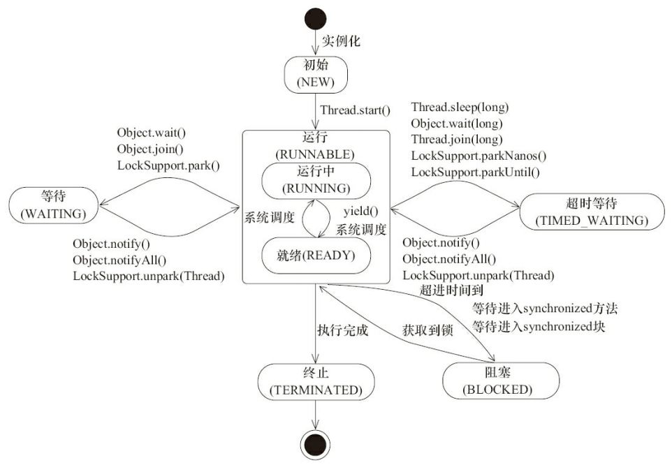
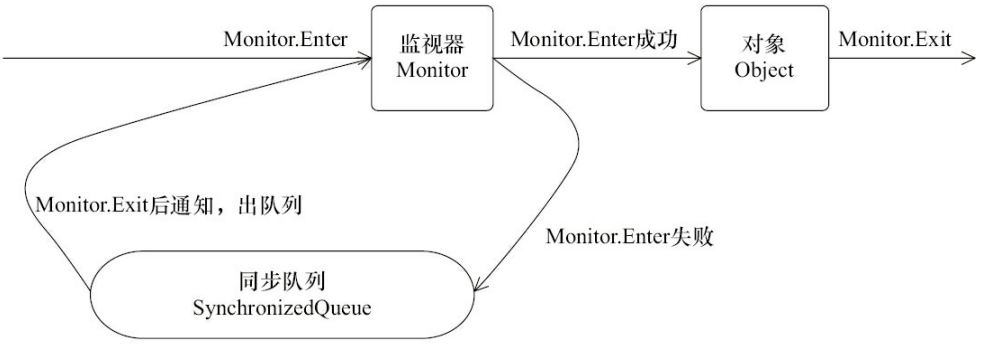
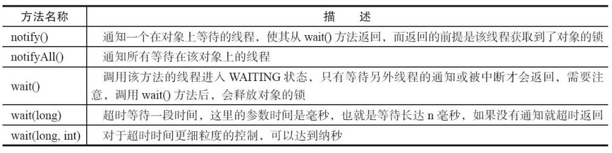
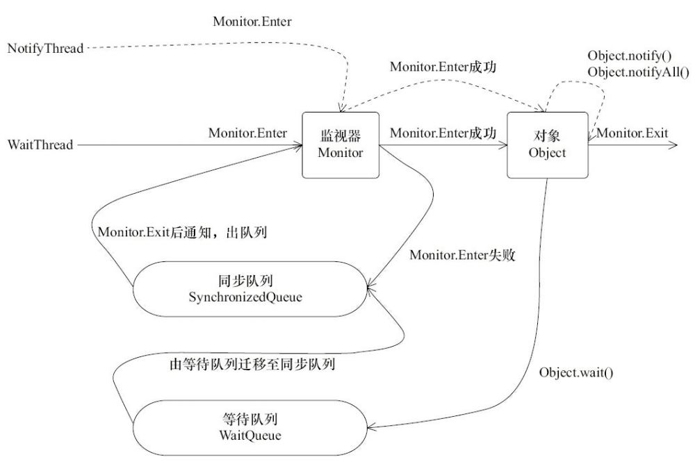

## Java并发编程基础 

#### 为什么要使用多线程?
`更多的处理器核心`
* 线程是大多数操作系统调度的基本单元，一个程序作为一个进程来运行，程序运行过程中能够创建多个线程
* 如果一个单线程程序在运行时只能使用一个处理器核心，那么再多的处理器核心加入也无法显著提升 该程序的执行效率。相反，如果该程序使用多线程技术，将计算逻辑分配到多个处理器核心 上，就会显著减少程序的处理时间，并且随着更多处理器核心的加入而变得更有效率。

`更快的响应时间`

* 一笔订单的创建，它包括插入订单数据、生成订单快照、发送邮件通知卖家和记录 货品销售数量等。用户从单击“订购”按钮开始，就要等待这些操作全部完成才能看到订购成 功的结果。但是这么多业务操作，如何能够让其更快地完成呢？ 
* 可以使用多线程技术，即将数据一致性不强的操作派发给其他线程处 理（也可以使用消息队列），如生成订单快照、发送邮件等。这样做的好处是响应用户请求的线 程能够尽可能快地处理完成，缩短了响应时间，提升了用户体验。

#### 线程优先级
线程 分配到的时间片多少也就决定了线程使用处理器资源的多少，而线程优先级就是决定线程需 要多或者少分配一些处理器资源的线程属性。
 * 在Java线程中，通过一个整型成员变量priority来控制优先级，优先级的范围从1~10，在线 程构建的时候可以通过setPriority(int)方法来修改优先级，默认优先级是5，优先级高的线程分 配时间片的数量要多于优先级低的线程。设置线程优先级时，针对频繁阻塞（休眠或者I/O操 作）的线程需要设置较高优先级，而偏重计算（需要较多CPU时间或者偏运算）的线程则设置较 低的优先级，确保处理器不会被独占。在不同的JVM以及操作系统上，线程规划会存在差异， 有些操作系统甚至会忽略对线程优先级的设定。

 `注意:`线程优先级不能作为程序正确性的依赖，因为操作系统可以完全不用理会Java 线程对于优先级的设定。

 #### 线程的状态

 

 `注意:`Java将操作系统中的运行和就绪两个状态合并称为运行状态。阻塞状态是线程 阻塞在进入synchronized关键字修饰的方法或代码块（获取锁）时的状态，但是阻塞在 java.concurrent包中Lock接口的线程状态却是等待状态，因为java.concurrent包中Lock接口对于 阻塞的实现均使用了LockSupport类中的相关方法。

 #### Daemon线程

 Daemon线程是一种支持型线程，因为它主要被用作程序中后台调度以及支持性工作。这 意味着，当一个Java虚拟机中不存在非Daemon线程的时候，Java虚拟机将会退出。可以通过调 用Thread.setDaemon(true)将线程设置为Daemon线程。

  `注意:`Daemon属性需要在启动线程之前设置，不能在启动线程之后设置,在构建Daemon线程时，不能依靠finally块中的内容来确保执行关闭或清理资源的逻辑。

  #### 中断

  * 中断可以理解为线程的一个标识位属性，它表示一个运行中的线程是否被其他线程进行 了中断操作。中断好比其他线程对该线程打了个招呼，其他线程通过调用该线程的interrupt() 方法对其进行中断操作。

  * 线程通过检查自身是否被中断来进行响应，线程通过方法isInterrupted()来进行判断是否 被中断，也可以调用静态方法Thread.interrupted()对当前线程的中断标识位进行复位。如果该 线程已经处于终结状态，即使该线程被中断过，在调用该线程对象的isInterrupted()时依旧会返回false。

  #### 过期的suspend()、resume()和stop()

  * suspend()、resume()和stop()方法完成了线程的暂停、恢复和终止工作，而且非常“人性化”。但是以suspend()方法为例，在调用后，线程不会释放已经占有的资源（比如锁），而是占有着资源进入睡眠状态，这样容易引发死锁问题。同样，stop()方法在终结一个线程时不会保证线程的资源正常释放，通常是没有给予线程完成资源释放工作的机会， 因此会导致程序可能工作在不确定状态下。

  * 暂停和恢复操作可以用等待/通知机制来替代。
#### 同步

* 同步块的实现使用了monitorenter和monitorexit指令，而同步方法则 是依靠方法修饰符上的ACC_SYNCHRONIZED来完成的。无论采用哪种方式，其本质是对一 个对象的监视器（monitor）进行获取，而这个获取过程是排他的，也就是同一时刻只能有一个 线程获取到由synchronized所保护对象的监视器。

* 任意一个对象都拥有自己的监视器，当这个对象由同步块或者这个对象的同步方法调用 时，执行方法的线程必须先获取到该对象的监视器才能进入同步块或者同步方法，而没有获 取到监视器（执行该方法）的线程将会被阻塞在同步块和同步方法的入口处，进入BLOCKED 状态。



* 任意线程对Object（Object由synchronized保护）的访问，首先要获得 Object的监视器。如果获取失败，线程进入同步队列，线程状态变为BLOCKED。当访问Object 的前驱（获得了锁的线程）释放了锁，则该释放操作唤醒阻塞在同步队列中的线程，使其重新 尝试对监视器的获取。

### 等待/通知机制

等待唤醒方法:



* 等待/通知机制依托于同步机制，其目的就是确保等待线程从 wait()方法返回时能够感知到通知线程对变量做出的修改。

* 1）使用wait()、notify()和notifyAll()时需要先对调用对象加锁。 
* 2）调用wait()方法后，线程状态由RUNNING变为WAITING，并将当前线程放置到对象的 等待队列。 
* 3）notify()或notifyAll()方法调用后，等待线程依旧不会从wait()返回，需要调用notify()或 notifAll()的线程释放锁之后，等待线程才有机会从wait()返回。
* 4）notify()方法将等待队列中的一个等待线程从等待队列中移到同步队列中，而notifyAll() 方法则是将等待队列中所有的线程全部移到同步队列，被移动的线程状态由WAITING变为 BLOCKED。 
* 5）从wait()方法返回的前提是获得了调用对象的锁。



* 等待/通知机制依托于同步机制，其目的就是确保等待线程从 wait()方法返回时能够感知到通知线程对变量做出的修改。

* 在上图，WaitThread首先获取了对象的锁，然后调用对象的wait()方法，从而放弃了锁并进入了对象的等待队列WaitQueue中，进入等待状态。由于WaitThread释放了对象的锁，
NotifyThread随后获取了对象的锁，并调用对象的notify()方法，将WaitThread从WaitQueue移到 SynchronizedQueue中，此时WaitThread的状态变为阻塞状态。NotifyThread释放了锁之后， WaitThread再次获取到锁并从wait()方法返回继续执行。

#### 等待/通知的经典范式

范式分为两部分，分别针对等待方（消费者）和通知方（生产者）。
<br/><br/>
`等待方`遵循如下原则。
* 1）获取对象的锁。
* 2）如果条件不满足，那么调用对象的wait()方法，被通知后仍要检查条件。
* 3）条件满足则执行对应的逻辑。

```java
synchronized(对象) { 
  while(条件不满足) { 
    对象.wait(); 
  }
  对应的处理逻辑 
}
```

`通知方`遵循如下原则。
* 1）获得对象的锁。
* 2）改变条件。
* 3）通知所有等待在对象上的线程

```java
synchronized(对象) { 
  改变条件 
  对象.notifyAll(); 
}
```

#### Thread.join()的使用

* 如果一个线程A执行了thread.join()语句，其含义是：当前线程A等待thread线程终止之后才 从thread.join()返回。线程Thread除了提供join()方法之外，还提供了join(long millis)和join(long millis,int nanos)两个具备超时特性的方法。这两个超时方法表示，如果线程thread在给定的超时时间里没有终止，那么将会从该超时方法中返回。

#### ThreadLocal的使用

* ThreadLocal，即线程变量，是一个以ThreadLocal对象为键、任意对象为值的存储结构。这个结构被附带在线程上，也就是说一个线程可以根据一个ThreadLocal对象查询到绑定在这个 线程上的一个值。 
* 可以通过set(T)方法来设置一个值，在当前线程下再通过get()方法获取到原先设置的值。

### 线程池技术

* 对于服务端的程序，经常面对的是客户端传入的短小（执行时间短、工作内容较为单一） 任务，需要服务端快速处理并返回结果。如果服务端每次接受到一个任务，创建一个线程，然 后进行执行，这在原型阶段是个不错的选择，但是面对成千上万的任务递交进服务器时，如果 还是采用一个任务一个线程的方式，那么将会创建数以万记的线程，这不是一个好的选择。因为这会使操作系统频繁的进行线程上下文切换，无故增加系统的负载，而线程的创建和消亡 都是需要耗费系统资源的，也无疑浪费了系统资源。
* 线程池技术能够很好地解决这个问题，它预先创建了若干数量的线程，并且不能由用户 直接对线程的创建进行控制，在这个前提下重复使用固定或较为固定数目的线程来完成任务 的执行。这样做的好处是，一方面，消除了频繁创建和消亡线程的系统资源开销，另一方面， 面对过量任务的提交能够平缓的劣化。

#### ThreadPool.java

```java
public interface ThreadPool<Job extends Runnable> { 
  // 执行一个Job，这个Job需要实现Runnable 
  void execute(Job job); 
  // 关闭线程池 
  void shutdown(); 
  // 增加工作者线程 
  void addWorkers(int num); 
  // 减少工作者线程 
  void removeWorker(int num); 
  // 得到正在等待执行的任务数量 
  int getJobSize(); 
}
```
#### DefaultThreadPool.java


```java
public class DefaultThreadPool<Job extends Runnable> implements ThreadPool<Job> {

  // 线程池最大限制数 
  private static final int MAX_WORKER_NUMBERS = 10; 
  // 线程池默认的数量 
  private static final int DEFAULT_WORKER_NUMBERS = 5; 
  // 线程池最小的数量 
  private static final int MIN_WORKER_NUMBERS = 1; 
  // 这是一个工作列表，将会向里面插入工作 
  private final LinkedList<Job> jobs = new LinkedList<Job>(); 
  // 工作者列表 
  private final List<Worker> workers = Collections.synchronizedList(new ArrayList<Worker>()); 
  // 工作者线程的数量 
  private int workerNum = DEFAULT_WORKER_NUMBERS; 
  // 线程编号生成 
  private AtomicLong threadNum = new AtomicLong();

  public DefaultThreadPool() { 
    initializeWokers(DEFAULT_WORKER_NUMBERS); 
  }
  
  public DefaultThreadPool(int num) { 
    workerNum = num > MAX_WORKER_NUMBERS MAX_WORKER_NUMBERS : num < MIN_WORKER_ NUMBERS MIN_WORKER_NUMBERS : num; initializeWokers(workerNum); 
  }

  ......

```

* 线程池的本质就是使用了一个线程安全的工作队列连接工作者线程和客户端线程，客户端线程将任务放入工作队列后便返回，而工作者线程则不断地从工作队列上取出 工作并执行。当工作队列为空时，所有的工作者线程均等待在工作队列上，当有客户端提交了 一个任务之后会通知任意一个工作者线程，随着大量的任务被提交，更多的工作者线程会被唤醒。

