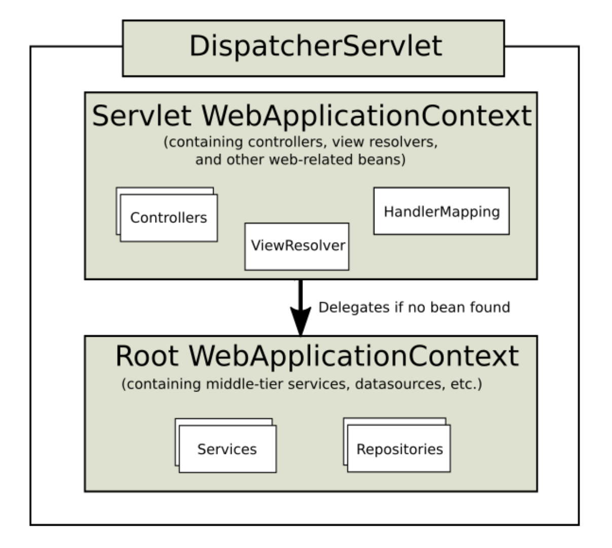

# Spring,SpringMVC 源码解析

## ServletContext

ServletContext为web应用级的上下文。web容器（tomcat、jboss）启动的时候，会为每个web应用程序创建一个ServletContext对象 它代表当前web应用的上下文。一个web中的所有servlet共享一个ServletContext对象，所以可以通过ServletContext对象来实现Servlet之间的通讯。在一个继承自HttpServlet对象的类中，可以通过`this.getServletContext`来获取。

## WebApplicationContext



1. RootWebApplicationContext
2. ServletWebApplicationContext

- RootWebApplicationContext为父容器，ServletWebApplicationContext为子容器，当启动的时候先会初始化ContextLoaderListener对应的RootWebApplicationContext，当部署/第一次HTTP访问的时候会将初始化ServletWebApplicationContext,并将RootWebApplicationContext注入其中。


- 在web.xml中servletContext和两个ApplicationContext的关系如下

```
servletContext>contextLoaderListener->RootWebApplicationContext->Spring

servletContext>dispacherServlet->Servlet WebApplicationContext->SpringMVC
```


spring与springMVC整合运行流程：

1. spi：tomcat启动时会通过SPI的机制加载所有包下面的META-INF/services/javax.servlet.ServletContainerInitializer，读取里面的内容。

2. 读取类上的@HandlerTypes里面的接口的所有实现类，然后调用实现类的onStartup方法

3. 创建父容器（RootWebApplicationContext）

4. 创建子容器：父容器创建之后，就开始创建子容器。此时也仅仅是创建而已，并没有调用核心方法refresh，真正的调用刷新方法是在dispatcherservlet调用init方法内。

5. 父容器刷新：spring中ContextLoaderListener监听器实现了servlet的ServletContextListener，servlet初始化会调用监听器contextInitialized方法，所以会调用到ContextLoaderListener.contextInitialized()。

6. 子容器刷新：servlet规范中，当一个servlet创建后会调用其init()方法，因此会调用DispathcerServlet.init()，其实现逻辑在父类HttpServletBean中，子容器刷新就是在该方法中实现。

7. 事件监听机制：上述父子容器刷新会调用onRefresh()这个就是spring的核心方法了，相信大家都比较熟悉，完成了所有的bean的实例化，并且放入到IOC容器中。在onRefresh()中会将拿到所有ApplicationListener的实现类，并且当spring容器初始化完成后，会调用其onApplicationEvent()方法，其实就是监听者设计模式。然而在FrameworkServlet中就有个内部类ContextRefreshListener实现了ApplicationListener，因此会调用onApplicationEvent()方法

## 关于DispatcherServlet

contextLoaderListener监听器初始化完毕后，开始初始化DispatcherServlet，下面为初始化方法的源码：

```java
protected void initStrategies(ApplicationContext context) {
        initMultipartResolver(context);
        initLocaleResolver(context);
        initThemeResolver(context);
        initHandlerMappings(context);
        initHandlerAdapters(context);
        initHandlerExceptionResolvers(context);
        initRequestToViewNameTranslator(context);
        initViewResolvers(context);
        initFlashMapManager(context);
}
```

- 需要做事情如下：
    - initMultipartResolver：初始化MultipartResolver，用于处理文件上传服务，如果有文件上传，那么就会将当前的HttpServletRequest包装成DefaultMultipartHttpServletRequest，并且将每个上传的内容封装成CommonsMultipartFile对象。需要在dispatcherServlet-servlet.xml中配置文件上传解析器。
    - initLocaleResolver：用于处理应用的国际化问题，本地化解析策略。
    - initThemeResolver：用于定义一个主题。
    - initHandlerMapping：用于定义请求映射关系。
    - initHandlerAdapters：用于根据Handler的类型定义不同的处理规则。
    - initHandlerExceptionResolvers：当Handler处理出错后，会通过此将错误日志记录在log文件中，默认实现类是SimpleMappingExceptionResolver。
    - initRequestToViewNameTranslators：将指定的ViewName按照定义的RequestToViewNameTranslators替换成想要的格式。
    - initViewResolvers：用于将View解析成页面。
    - initFlashMapManager：用于生成FlashMap管理器。

### 核心方法 doDispatch()

```java
protected void doDispatch(HttpServletRequest request, HttpServletResponse response) throws Exception {
    HttpServletRequest processedRequest = request;
    HandlerExecutionChain mappedHandler = null;
    boolean multipartRequestParsed = false;
    WebAsyncManager asyncManager = WebAsyncUtils.getAsyncManager(request);

    try {
        try {
            ModelAndView mv = null;
            Object dispatchException = null;

            try {
                processedRequest = this.checkMultipart(request);
                multipartRequestParsed = processedRequest != request;
                mappedHandler = this.getHandler(processedRequest);
                if (mappedHandler == null || mappedHandler.getHandler() == null) {
                    this.noHandlerFound(processedRequest, response);
                    return;
                }

                HandlerAdapter ha = this.getHandlerAdapter(mappedHandler.getHandler());
                String method = request.getMethod();
                boolean isGet = "GET".equals(method);
                if (isGet || "HEAD".equals(method)) {
                    long lastModified = ha.getLastModified(request, mappedHandler.getHandler());
                    if (this.logger.isDebugEnabled()) {
                        this.logger.debug("Last-Modified value for [" + getRequestUri(request) + "] is: " + lastModified);
                    }

                    if ((new ServletWebRequest(request, response)).checkNotModified(lastModified) && isGet) {
                        return;
                    }
                }

                if (!mappedHandler.applyPreHandle(processedRequest, response)) {
                    return;
                }

                mv = ha.handle(processedRequest, response, mappedHandler.getHandler());
                if (asyncManager.isConcurrentHandlingStarted()) {
                    return;
                }

                this.applyDefaultViewName(processedRequest, mv);
                mappedHandler.applyPostHandle(processedRequest, response, mv);
            } catch (Exception var20) {
                dispatchException = var20;
            } catch (Throwable var21) {
                dispatchException = new NestedServletException("Handler dispatch failed", var21);
            }

            this.processDispatchResult(processedRequest, response, mappedHandler, mv, (Exception)dispatchException);
        } catch (Exception var22) {
            this.triggerAfterCompletion(processedRequest, response, mappedHandler, var22);
        } catch (Throwable var23) {
            this.triggerAfterCompletion(processedRequest, response, mappedHandler, new NestedServletException("Handler processing failed", var23));
        }

    } finally {
        if (asyncManager.isConcurrentHandlingStarted()) {
            if (mappedHandler != null) {
                mappedHandler.applyAfterConcurrentHandlingStarted(processedRequest, response);
            }
        } else if (multipartRequestParsed) {
            this.cleanupMultipart(processedRequest);
        }

    }
}

```

DispatcherServlet处理该类请求的步骤：

- 在接收到请求后，通过几级Servlet类型的父类的处理，先调用doService在request中设置一些必需的参数。最终会调用DispatcherServlet的doDispatch方法。
- 在doDispatch方法中，首先检测request是否包含多媒体类型（如文件上传），然后将检测后的request转换为processedRequest对象。之后检测processedRequest对象是否为原始request（如果是，即原来的request不包含多媒体信息），然后将boolean结果赋给multipartRequestParsed变量（若multipartRequestParsed为true，在最后会清除processedRequest对象中的多媒体信息）。
- 通过调用处理器映射器查找Handler。调用getHandler来获取相关的处理器对象。在getHandler方法中，利用处理器映射器HandlerMapping通过request来获取一个包含Handler处理器本身和其前后拦截器interceptor的处理器执行链HandlerExecutionChain对象。
- 通过HandlerExecutionChain对象获取具体的Handler处理器对象，此时使用getHandlerAdapter方法获取可以处理类型的处理器适配器HandlerAdapter对象。
- 调用HandlerAdapter对象的handle方法，将可能带有多媒体信息的processRequest对象，原始request对象，以及Handler处理器本身作为参数传入，handle方法会根据这些参数去执行开发者自己开发的Handler的相关
请求处理逻辑，并返回含有反馈信息和结果视图信息的ModelAndView对象。
- 获得ModelAndView对象后，会进行视图渲染，将model数据填充到request域。在processDispatchResult方法中会对ModelAndView对象进行处理。而在processDispatchResult方法中包含一个render方法，其参数为ModelAndView对象以及request和response对象。在render方法中，通过resolveViewName会获取到实际需要使用的视图View对象，执行具体的View对象的render方法来完成数据的显示过程。
