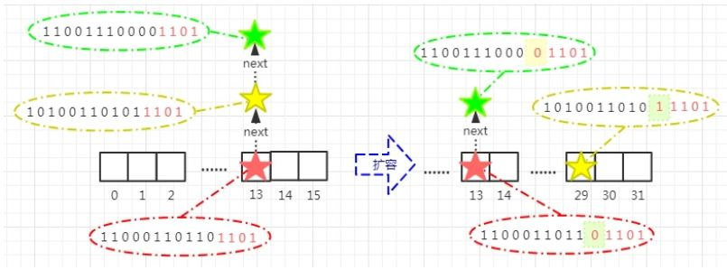

## hashmap
HashMap基于哈希表的Map接口实现，以key-value存储形式存在。（除了不同步和允许使用 null 之外，HashMap 类与 Hashtable 大致相同。)

- HashMap 的实现不是同步的，这意味着它不是线程安全的。它的key、value都可以为null。此外，HashMap中的映射不是有序的。在 JDK1.8 中，HashMap 是由 数组+链表+红黑树构成，新增了红黑树作为底层数据结构，结构变得复杂了，但是效率也变的更高效。

- HashMap的主干类是一个Enty数组(jdk 1.7),每个Enty都包含有一个键值对（key-value）

- 在 JDK1.8 中，HashMap 是由 数组+链表+红黑树构成，新增了红黑树作为底层数据结构，结构变得复杂了，但是效率也变的更高效。当一个值中要存储到Map的时候会根据Key的值来计算出他的hash，通过哈希来确认到数组的位置，如果发生哈希碰撞就以链表的形式存储 在Object源码分析中解释过，但是这样如果链表过长来的话，HashMap会把这个链表转换成红黑树来存储。

### HashMap为什么要使用红黑树

因为Map中桶的元素初始化是链表保存的，其查找性能是O(n)，而树结构能将查找性能提升到O(log(n))。当链表长度很小的时候，即使遍历，速度也非常快，但是当链表长度不断变长，肯定会对查询性能有一定的影响，所以才需要转成树。至于为什么阈值是8，我想，去源码中找寻答案应该是最可靠的途径。

### HashMap几个重要字段

```java
/**
实际存储的key-value键值对的个数
*/
transient int size;

/**
阈值，当table == {}时，该值为初始容量（初始容量默认为16）；当table被填充了，也就是为table分配内存空间后，
threshold一般为 capacity*loadFactory。HashMap在进行扩容时需要参考threshold，后面会详细谈到
*/
int threshold;

/**
负载因子，代表了table的填充度有多少，默认是0.75
加载因子存在的原因，还是因为减缓哈希冲突，如果初始桶为16，等到满16个元素才扩容，某些桶里可能就有不止一个元素了。
所以加载因子默认为0.75，也就是说大小为16的HashMap，到了第13个元素，就会扩容成32。
*/
final float loadFactor;

/**
HashMap被改变的次数，由于HashMap非线程安全，在对HashMap进行迭代时，
如果期间其他线程的参与导致HashMap的结构发生变化了（比如put，remove等操作），
需要抛出异常ConcurrentModificationException*/
transient int modCount;

```

- initialCapacity默认为16，loadFactory默认为0.75

### 为何HashMap的数组长度一定是2的次幂

>当 array.ength长度是2的次幂时，key.hashcode % array.length等于key.hashcode & (array.length - 1)

>hashmap扩容的元素迁移过程中，由于数组大小是2次幂的巧妙设定，使得只要检查 “ 特殊位 ” 就能确定该元素的最终定位。



红、绿二星所表示的元素的hashcode“ 特殊位 ”为0，取余依然定位在槽13；而黄星表示的元素，hashcode“ 特殊位 ”为1，取余后结果 = 原槽索引 + 原数组大小 = 13 + 16 = 29。（这个结果也和图中黄星的hashcode二进制低位值11101一致）

- 能利用 & 操作代替 % 操作，提升性能
- 数组扩容时，仅仅关注 “特殊位” 就可以重新定位元素

### 为什么默认loadFactory是0.75
``` 
As a general rule, the default load factor (.75) offers a good tradeoff between time and space costs. Higher values decrease the space overhead but increase the lookup cost (reflected in most of the operations of the HashMap class, including get and put).
```

- 负载因子不能太大，不然会导致大量的哈希冲突，也不能太小，那样会浪费空间。一般来说，默认的负载因子(0.75)在时间和空间成本之间提供了很好的权衡。更高的值减少了空间开销，但增加了查找成本(反映在HashMap类的大多数操作中，包括get和put)。

[loadFactory是0.75的数学证明](https://stackoverflow.com/questions/10901752/what-is-the-significance-of-load-factor-in-hashmap)

### 为什么HashMap的默认容量是16

- 根据作者的推断，这应该就是个经验值（Experience Value），既然一定要设置一个默认的2^n 作为初始值，那么就需要在效率和内存使用上做一个权衡。这个值既不能太小，也不能太大。

- 太小了就有可能频繁发生扩容，影响效率。太大了又浪费空间，不划算。

- 所以，16就作为一个经验值被采用了。

>在JDK 8中，关于默认容量的定义为：static final int DEFAULT_INITIAL_CAPACITY = 1 << 4;其故意把16写成1<<4，就是提醒开发者，这个地方要是2的幂。

### HashMap线性不安全

- 在多个线程并发扩容时，会在执行transfer()方法转移键值对时，造成链表成环，导致程序在执行get操作时形成死循环。

```java
 transfer(Entry[] newTable, boolean rehash) {
    int newCapacity = newTable.length;
    //遍历table数组中键值对链
    for (Entry<K,V> e : table) {
        //遍历键值对e链上的所有键值对，当e指向null时结束
        while(null != e) {
            Entry<K,V> next = e.next;//断点一
            //通常rehash为false，不会重新计算键值对key的hash值
            if (rehash) {
                e.hash = null == e.key ? 0 : hash(e.key);
            }
            //根据扩容后的table数组长度计算键值对的index
            int i = indexFor(e.hash, newCapacity);
            //头插法，将后遍历的键值对存到链条的头部
            e.next = newTable[i];
            newTable[i] = e;
            //链条中的下一个键值对继续执行while循环。
            e = next;
        }
    }
}
```