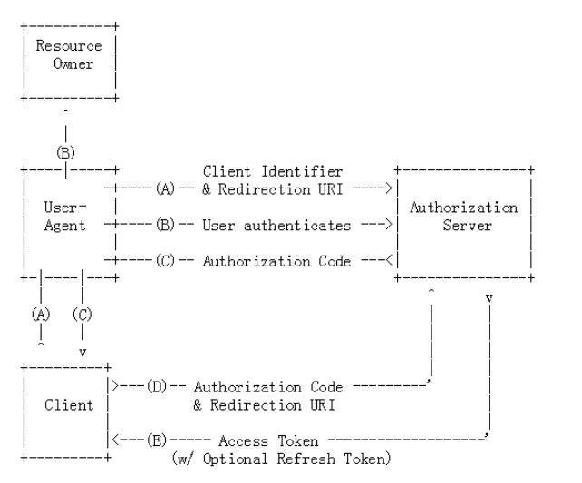

# [OAuth 2.0](https://oauth.net/2/)

OAuth 2.0中的一种机制，用于限制应用程序对用户帐户的访问。应用程序可以请求一个或多个范围，然后在同意屏幕中将此信息呈现给用户，并且颁发给该应用程序的访问令牌将限于所授予的范围。

OAuth规范允许授权服务器或用户与请求的内容相比修改授予应用程序的范围，尽管实际上没有很多服务示例可以这样做。

OAuth没有为范围定义任何特定的值，因为它高度依赖于服务的内部体系结构和需求。

## 概念名词：
1）Third-party application：第三方应用程序（client）。

2）HTTP service：HTTP服务提供商。

3）Resource Owner：资源所有者"用户"（user）。

4）User Agent：用户代理-浏览器。

5）Authorization server：认证服务器，即服务提供商专门用来处理认证的服务器。

6）Resource server：资源服务器，即服务提供商存放用户生成的资源的服务器。它与认证服务器，可以是同一台服务器，也可以是不同的服务器。

## 四种授权方式

- 密码模式（resource owner password credentials）
- 授权码模式（authorization code）
- 简化模式（implicit）
- 客户端模式（client credentials）

## 密码模式

密码模式中，用户向客户端提供自己的用户名和密码。客户端使用这些信息，向 "服务商提供商" 索要授权。在这种模式中，用户必须把自己的密码给客户端，但是客户端不得储存密码。这通常用在用户对客户端高度信任的情况下，比如客户端是操作系统的一部分。

一个典型的例子是同一个企业内部的不同产品要使用本企业的 oAuth2.0 体系。在有些情况下，产品希望能够定制化授权页面。

这种模式主要用来做遗留项目升级为oauth2的适配方案。如果client是自家的应用，也是可以支持refresh token

## 授权码模式

授权码模式适用于有自己的服务器的应用，它是一个一次性的临时凭证，用来换取 access_token 和 refresh_token。

- 这种模式算是正宗的oauth2的授权模式
- 设计了auth code，通过这个code再获取token
- 支持refresh token

## 简化模式

简化模式适用于纯静态页面应用。所谓纯静态页面应用，也就是应用没有在服务器上执行代码的权限（通常是把代码托管在别人的服务器上），只有前端 JS 代码的控制权。

这种场景下，应用是没有持久化存储的能力的。因此，按照 oAuth2.0 的规定，这种应用是拿不到 Refresh Token 的。

## 客户端模式

调用者是一个后端的模块，没有用户界面的时候，可以使用客户端模式。鉴权服务器直接对客户端进行身份验证，验证通过后，返回 token。

- 这种模式直接根据client的id和密钥即可获取token，无需用户参与
- 这种模式比较合适消费api的后端服务，比如拉取一组用户信息等
- 不支持refresh token，主要是没有必要
refresh token的初衷主要是为了用户体验不想用户重复输入账号密码来换取新token，因而设计了refresh token用于换取新token

这种模式由于没有用户参与，而且也不需要用户账号密码，仅仅根据自己的id和密钥就可以换取新token，因而没必要refresh token
